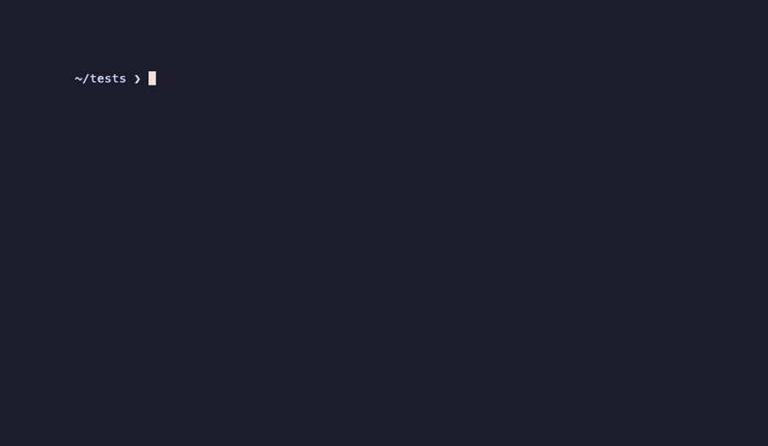

# 🦞 lobster

> **CLI-first, open-source, end-to-end BDD testing — no SaaS, no billing, no limits.**

Lobster is a Behaviour-Driven Development (BDD) testing framework built for engineers who want to test their *entire stack* — not just units or isolated services. Write human-readable Gherkin feature files, point lobster at your Docker Compose infrastructure, and let it orchestrate, execute, and report your full end-to-end test suite from the command line or inside CI.

Runtime binaries:

- `lobster`: local/client CLI for authoring, validation, planning, and run submission
- `lobsterd`: long-running remote daemon and Wish host for VM or server deployments

Development model:

- Lobster is dual-developed by BCP Technology as an internal production tool and an open GitHub project.
- Internal and GitHub development track the same codebase.
- Changes developed internally are published alongside open development updates.
- GitHub contributions are included in the same ongoing internal development stream.

[](LICENSE)
[](https://go.dev)
[](https://github.com/bcp-technology-ug/lobster/actions/workflows/ci.yml)
[](https://github.com/bcp-technology-ug/lobster/releases/latest)
[](https://goreportcard.com/report/github.com/bcp-technology-ug/lobster)
[](https://codecov.io/gh/bcp-technology-ug/lobster)
[](https://github.com/bcp-technology-ug/lobster/actions/workflows/codeql.yml)
[](CODE_OF_CONDUCT.md)

---



---

## Why lobster?

Most E2E testing tools are either SaaS products with billing tiers, framework-specific (Playwright for browsers, Postman for APIs), or require significant glue code to stand up real infrastructure. Lobster is different:

- **Infrastructure-aware** — reads your existing Docker Compose files and manages the full service lifecycle.
- **BDD-first** — plain-language Gherkin tests that are readable by engineers *and* stakeholders.
- **CLI/CI-first** — designed to run headlessly in pipelines, with optional TUI capabilities as the project evolves.
- **Remote-capable** — optional daemon execution for teams that run tests on stronger remote hosts.
- **Extensible by design** — v0.1 ships with built-in static extension registries, with runtime plugin loading planned for a later release.
- **Open forever** — MIT licensed, no telemetry, no accounts, no limits.

---

## Features

- Parse, validate, and lint `.feature` (Gherkin) files
- Local in-process execution mode and remote daemon execution mode
- Proto-first API contracts with gRPC and gRPC-Gateway HTTP support
- Charm Wish as an optional remote client surface against the same backend
- Support `Background` and `Scenario Outline` in v0.1 feature execution
- Support Gherkin Data Tables in v0.1 step arguments
- Orchestrate Docker Compose stacks with Docker SDK-backed lifecycle control and health-aware startup
- Built-in step definitions for HTTP, JSON assertions, retries, and waits
- Built-in auth helpers for Bearer, Basic, API key, mTLS, and OAuth device/code flows
- Minimal first-class Keycloak integration for v0.1 (realm setup, user provisioning, token acquisition)
- Console summary, JUnit XML, and JSON report output for CI systems
- Domain-driven Go architecture built around clear package boundaries and testability
- Future interactive TUI path powered by [Bubbletea](https://github.com/charmbracelet/bubbletea), [Lipgloss](https://github.com/charmbracelet/lipgloss), and [Bubbles](https://github.com/charmbracelet/bubbles)
- Deterministic serial scenario execution in v0.1 with structured exit codes
- Undefined steps are collected during run and reported together before failing
- JSONPath-based assertions with configurable HTTP base URL and default headers
- Optional soft-assert mode, matrix profile runs, and basic OpenTelemetry trace export in v0.1
- Per-scenario reset and idempotent seed policy for deterministic test data in v0.1
- Configurable migration mode (`auto`, `external`, `disabled`) per environment profile
- SQLite persistence with sqlc query generation for run history and detailed results
- Dogfooding-first testing: Lobster integration and E2E suites are executed by Lobster itself
- Quarantine-tag workflow for flaky tests (`@quarantine`) with separate non-blocking CI routing
- Terraform-style planning via `lobster plan` before execution
- Saved plan artifacts with apply-style execution via `lobster run --from-plan`
- Monorepo workspace discovery and workspace-targeted execution in v0.1
- Compose profile selection and configurable cache controls (`--no-cache` override)
- Hierarchical run output (Feature -> Scenario -> Step) with `-v/-vv/-vvv` verbosity levels

---

## Quick start

### Prerequisites

- [Go 1.25+](https://go.dev/dl/)
- A C compiler (`gcc` on Linux/macOS, [MinGW-w64](https://www.mingw-w64.org/) on Windows) — required because lobster embeds SQLite via CGO
- [Docker](https://docs.docker.com/get-docker/) with Compose v2

### Install

```bash
go install github.com/bcp-technology-ug/lobster@latest
```

### Initialise a project

```bash
lobster init my-project
cd my-project
```

This creates a `lobster.yaml` config file and a `features/` directory with a sample feature file.

### Write a test

```gherkin
# features/api/health.feature
Feature: API health check
  As an operator
  I want the API to report healthy
  So that I know the service is running

  Scenario: Health endpoint returns 200
    Given the service "api" is running
    When I send a GET request to "/health"
    Then the response status should be 200
    And the response body should contain "ok"
```

### Validate and run

```bash
# Lint and validate all feature files
lobster validate
lobster lint

# Spin up Docker Compose, run all tests, tear down
lobster run
```

Optional remote daemon execution:

```bash
lobsterd start --listen :9443 --http-listen :8080 --db-path /var/lib/lobster/lobster.db

lobster run --executor-mode daemon --executor-addr dns:///lobsterd.internal:9443 --run-mode sync
```

### Current status

Lobster `v0.1.0` is the initial public release.

- The core execution loop (`init`, `validate`, `lint`, `plan`, `run`, `config`) is stable.
- Split-binary model: `lobster` (CLI client) and `lobsterd` (remote daemon) with gRPC + HTTP/JSON gateway.
- SemVer versioning from this release onwards; `lobster --version` and `lobsterd --version` reflect the release tag.
- Before v1.0, minor versions may include breaking changes with explicit deprecation warnings and removal targets.
- Runtime plugin loading and a richer interactive TUI are planned for later iterations.

---

## Documentation

| Document | Description |
|---|---|
| [Getting started](docs/getting-started.md) | Install, initialise, write your first test |
| [Core concepts](docs/concepts.md) | BDD, Gherkin, and how lobster works |
| [Project structure](docs/project-structure.md) | Planned Go package layout and dependency boundaries |
| [Architecture](docs/architecture.md) | Internal design and component overview |
| [Spec definition](docs/spec-definition.md) | Contract-first workflow and checklist for new capabilities |
| [API reference](docs/api-reference.md) | Canonical proto-first transport contract |
| [CLI reference](docs/cli-reference.md) | All commands, flags, and examples |
| [Configuration](docs/configuration.md) | `lobster.yaml` schema and environment variables |
| [Configuration profiles](docs/config-profiles.md) | Local, CI, and debug profile templates |
| [Persistence](docs/persistence.md) | SQLite, sqlc, migrations, and retention policy |
| [Docker Compose integration](docs/docker-compose-integration.md) | Stack lifecycle, health checks, networking |
| [Step definitions](docs/step-definitions.md) | Built-in steps and the extension model |
| [Integrations](docs/integrations.md) | Service adapters (Keycloak and beyond) |
| [Testing strategy](docs/testing.md) | Unit, integration, E2E, and dogfooding policy |
| [CI/CD](docs/ci-cd.md) | GitHub Actions, GitLab CI, exit codes, reports |
| [Roadmap](ROADMAP.md) | What is planned for v0.2, v0.3, and v1.0 |
| [Support](SUPPORT.md) | How to get help, report bugs, and request features |

---

## Contributing

Contributions are welcome. Please read [CONTRIBUTING.md](CONTRIBUTING.md) before opening a pull request.

Have a question or need help? Open a [GitHub Discussion](https://github.com/bcp-technology-ug/lobster/discussions) or read [SUPPORT.md](SUPPORT.md) for all support options.

---

## Code of Conduct

This project follows the [Contributor Covenant 2.1](CODE_OF_CONDUCT.md). Please be kind.

---

## Mission

Read [MISSION.md](MISSION.md) for the full mission statement — what lobster is, what it will never become, and the principles that guide its development.

---

## License

[MIT](LICENSE) © 2026 BCP Technology
